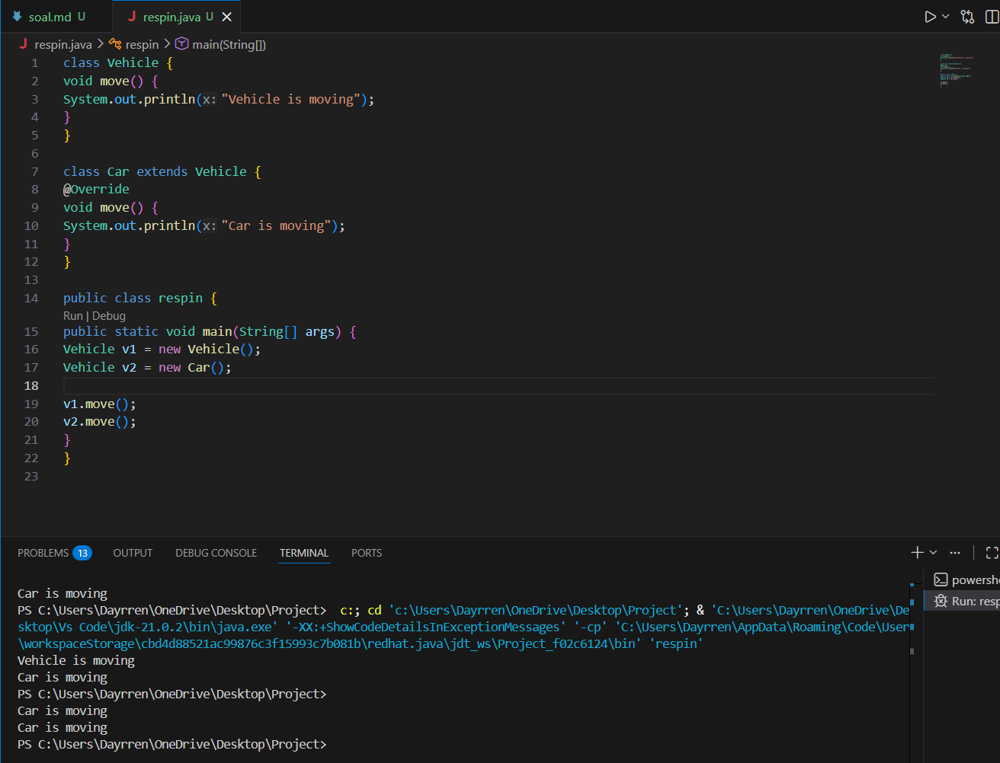
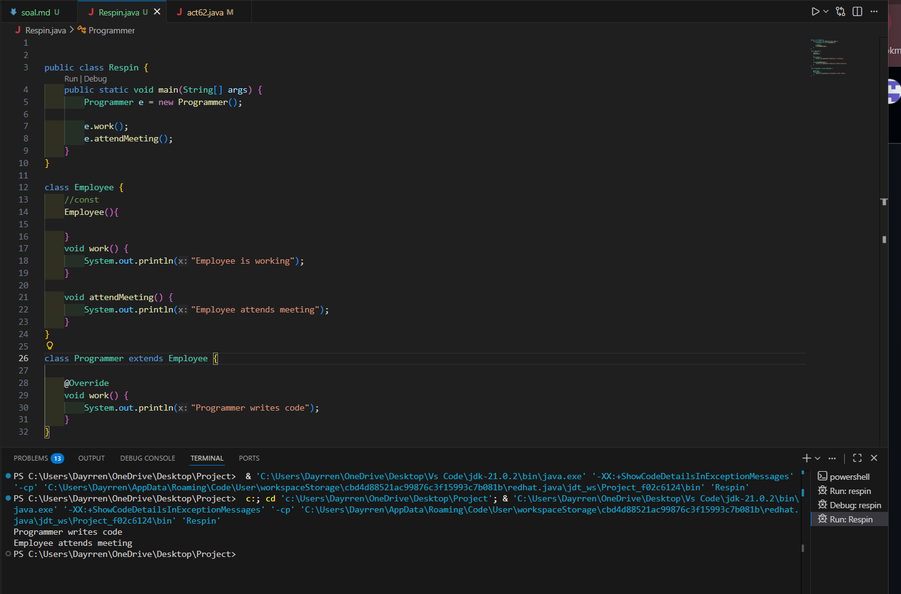

1. 
    output program : "Meow"
    program tersebut menghasilkan output meow karena saat dicompile, compiler hanya melihat apa yang ada di tipe variable Animal. Berbeda saat runtime, saat runtime JVM melihat tipe object yaitu Cat. Artinya saat runtime, yang dijalankan program adalaah method yang dimiliki oleh Animal dan Cat, namun yang dijalankan adalah method pada superclassnya, yaitu Animal ( sound()). Tanpa perlu command @override, program sebenarnya sudah menentukan method mana yang akan dieksekusi saat runtime.

2. 
    v1.move() 
    output : Vehicle is moving 
    v2.move()
    output : Car is moving

    v1.move() menghasilkan output vehicle is moving karena saat compile, compiler melihat tipe variable v1 yaitu vehicle sehingga compiler mengetahui apa yang ada dalam class vehicle, yaitu method move. Saat runtime pun JVM melihat tipe object dari v1 yaitu Vehicle, sehingga saat mengeksekusi program, JVM juga mengeksekusi method move yang ada dalam Vehicle.

    Berbeda dengan v2.move(), menghasilkan output car is moving karena saat compile, compiler memang melihat tipe variable v2 yaitu Vehicle, namun saat runtime, JVM melihat tipe object dari v2 yaitu Car. Sehingga JVM akan mengeksekusi method yang ada di Car.

3.  
    output : 
    Programmer writes code
    Employee attends meeting

    mengapa outputnya seperti itu?
    = e.work() menghasilkan output seperti itu karena JVM menjalankan versi method work() Programmer, karena JVM melihat tipe object versi Programmer. Compiler hanya tahu isi dari Employee, yaitu work dan attendmeeting. Sehingga JVM menjalankan method work dari Programmer
    
    Inheritance :
    - class programmer extends Employee
    Override : 
    - void work()